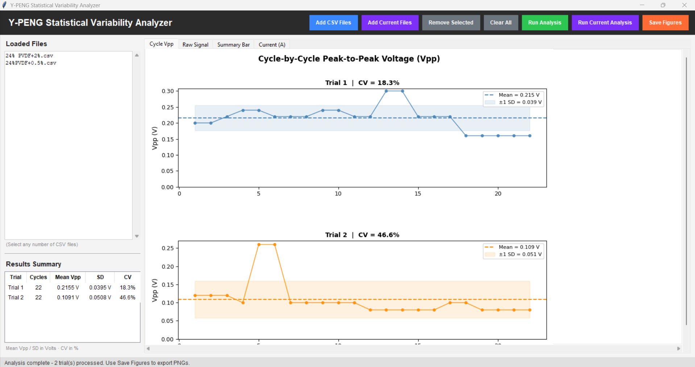
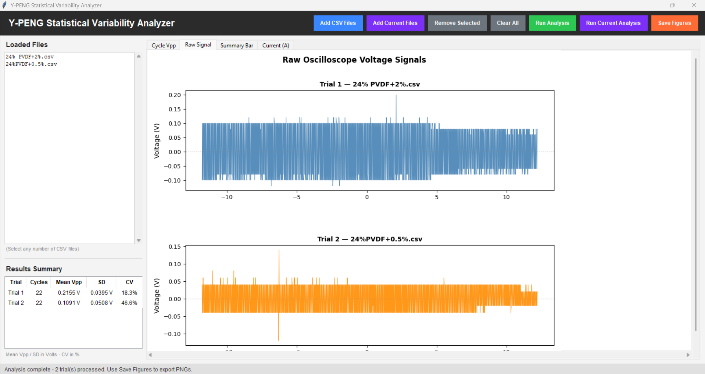
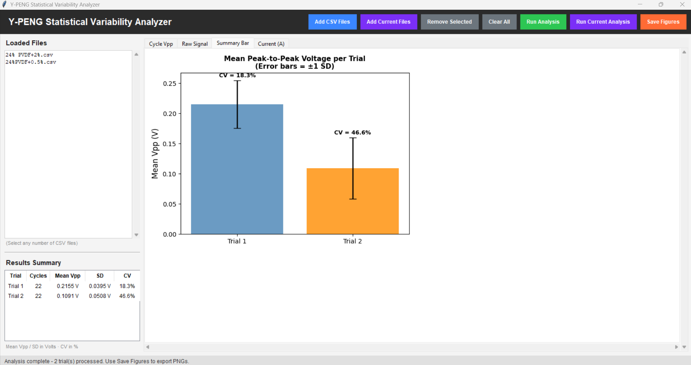

# Y-PENG Research: Data Analysis Tool 

> Presented poster at the [2026 CURO Symposium](https://curo.uga.edu/wp-content/uploads/2026/04/CURO2026-program.pdf), University of Georgia

## Abstract
The widespread utilization of wearable technologies is rising at a significant rate, necessitating a growing demand for energy harvesters. Yarn-based piezoelectric nanogenerators (Y-PENGs) have emerged as a promising innovation capable of converting the human body's mechanical motion into electrical energy. Previous studies on Y-PENG devices, which consist of a hybrid layer of electrospun polyvinylidene fluoride (PVDF) nanofibers and a solid film layer of PVDF around a silver-deposited nylon filament (core), report peak voltage outputs and durability under substantial cyclic loading. However, a statistical evaluation of cycle-to-cycle voltage variability under loading conditions remains limited. Inconsistent voltage output limits reliable integration into real-world wearable systems. This study aims to present the cycle-by-cycle voltage variability of PVDF-coated Y-PENG devices under cyclic loading, allowing for the development of quantitative performance standards for assessing electrical repeatability in Y-PENG devices. A digital oscilloscope will be used to record the output voltage as Y-PENG devices are subjected to repetitive mechanical compressions. Using a cycle-resolved computational process, peak-to-peak (Vpp) will be extracted for each individual loading cycle across 4 independent datasets. To evaluate the output distribution and inter-trial consistency, statistical descriptors such as mean Vpp, standard deviation, and coefficient of variation (CV) will be calculated. The results of this study will support more rigorous performance reporting in wearable energy harvesting studies by focusing on variability rather than peak performance.

> Research question:
Does each piezoelectric nanogenerator produce a stable, repeatable output, or is its performance highly variable?

> Coefficient of Variation (CV) is the core statistic; lower CV = more consistent device

## Key Features
- **Sliding Window Vpp Extraction** - cycle-resolved peak-to-peak voltage 
  computed 
- **Statistical Variability Analysis** - mean, standard deviation, and 
  coefficient of variation (CV) calculated per trial
- **Multi-Trial Comparison** - load and compare several independent trials 
  simultaneously
- **Interactive GUI** - file selection, results table, and tabbed figure 
  viewer built with Tkinter
- **Automatic Visualization & Publication-Ready Figures** - raw voltage traces, cycle-by-cycle Vpp 
  plots, and summary bar charts exportable as publication-ready images
- **Web Dashboard** - lightweight CSV explorer for quick data inspection

## Screenshots of Data Analysis Tool
Cycle-by-Cycle Vpp Plot:


Raw Oscilloscope Signal:


Summary Bar Chart:


## Structure
| Path | Description |
|------|-------------|
| `scripts/ypeng_analysis.py` | **Main tool.** GUI app for Vpp analysis - load CSVs, compute stats (Vpp, CV, etc), export figures |
| `dashboard/` | Lightweight web viewer for exploring raw CSV data |

## Running the Analysis Script
```
pip install -r requirements.txt
python scripts/ypeng_analysis.py
```

## Running the Dashboard
```
pip install -r requirements.txt
streamlit run dashboard/Home.py
```

View the dashboard web-app (Quick CSV explorer): [https://dashboard-ypeng.streamlit.app/](https://dashboard-ypeng.streamlit.app/)

## Tech Stack
- Python
- pandas
- NumPy
- Matplotlib
- Tkinter
- Streamlit

## Links
[Innovative Materials Team website](https://www.fcs.uga.edu/tmi/innovative-materials-research-team)

[2026 CURO Symposium Program Book](https://curo.uga.edu/wp-content/uploads/2026/04/CURO2026-program.pdf)

[Live Dashboard](https://dashboard-ypeng.streamlit.app/)